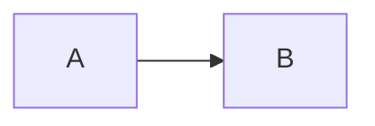
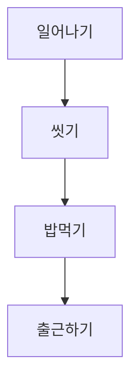
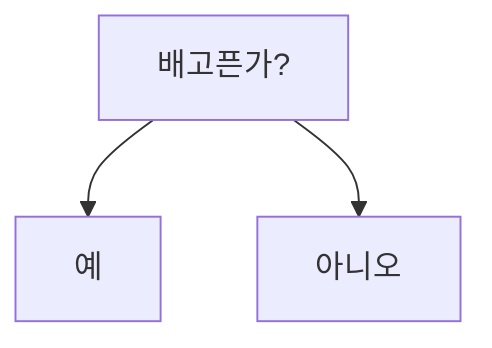
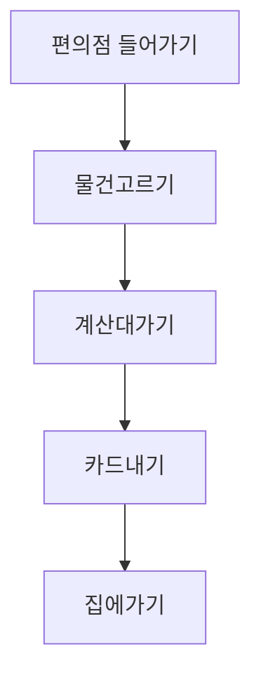

# Mermaid 다이어그램 - 왕초보 가이드

## 이게 뭐예요?

**Mermaid**는 글로 그림을 그리는 도구예요.
코드처럼 텍스트를 쓰면 자동으로 예쁜 그림이 됩니다.

---

## 가장 간단한 예시

### 박스 2개 연결하기

**이게 끝이에요!**
- `A`라는 박스에서 `B`라는 박스로 화살표가 그려집니다.

---

## 박스에 글자 넣기

- `[시작]` 이렇게 대괄호 안에 원하는 글자를 쓰면 돼요.

---

## 박스 3개 연결하기

- `-->` 화살표를 계속 이어서 쓰면 됩니다.

---

## 위에서 아래로 그리기

- `graph TD` : **T**op **D**own (위에서 아래로)
- `graph LR` : **L**eft **R**ight (왼쪽에서 오른쪽으로)

---

## 분기 만들기 (선택하기)

**이제 이 정도면 됐어요!**

이 5가지만 알면 MISTO POS 다이어그램을 읽을 수 있어요.

---

## 실전 연습: 편의점에서 물건 사기

**이게 전부예요!**

---

## 다음 단계

이제 MISTO POS 파일들을 열어보세요:

1. **01-system-architecture.md** 열어보기
2. 박스들이 뭔지 읽어보기
3. 화살표 따라가면서 흐름 이해하기

**그게 다예요!** 복잡해 보여도 결국 "박스"와 "화살표"뿐이에요.
