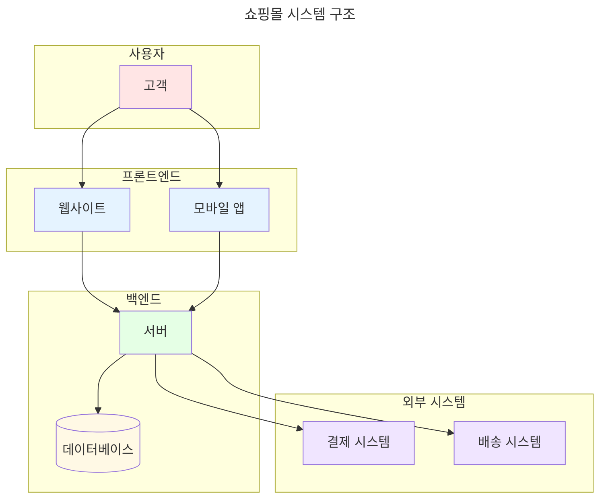
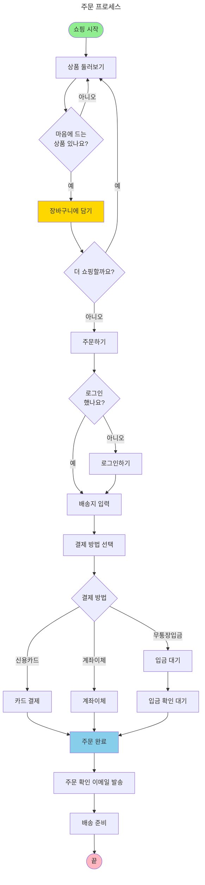
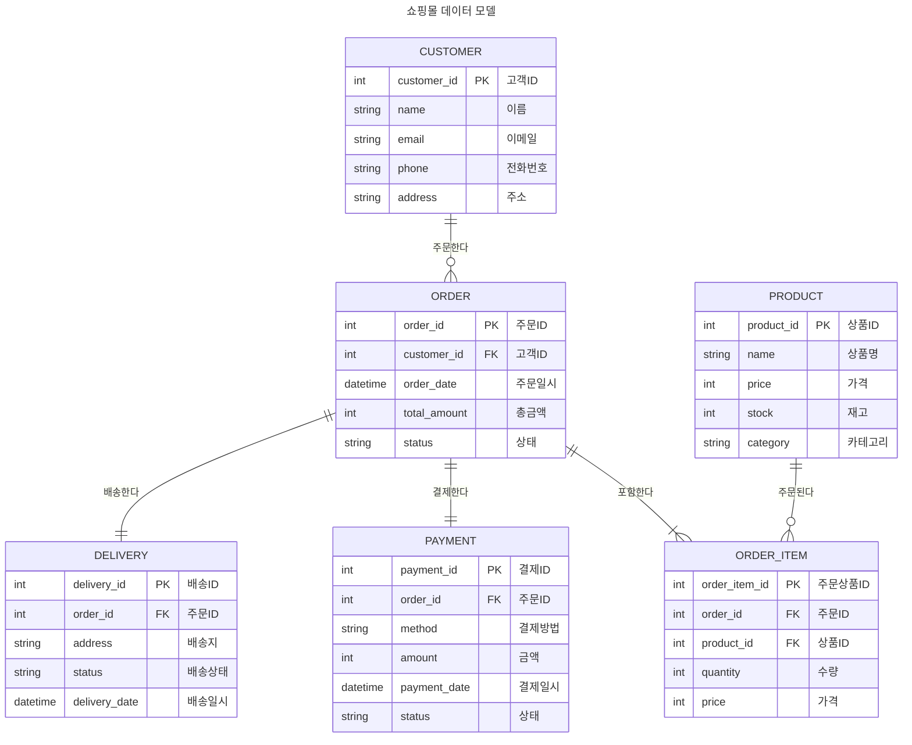
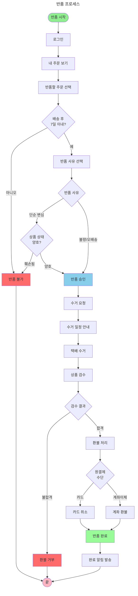

# 쇼핑몰 시스템 - 초간단 예시 가이드

이 문서는 Mermaid 다이어그램을 처음 배우는 분들을 위한 아주 쉬운 예시입니다.

---

## 1. 시스템 구조도 (System Architecture)

온라인 쇼핑몰의 전체 구조를 보여줍니다.



**설명:**
- **고객**: 웹사이트나 모바일 앱으로 쇼핑
- **서버**: 주문을 처리하고 데이터베이스에 저장
- **결제/배송**: 외부 시스템과 연동

---

## 2. 주문 프로세스 (Order Process)

고객이 상품을 주문하는 전체 과정입니다.



**설명:**
1. **상품 선택**: 원하는 상품을 장바구니에 담기
2. **로그인**: 주문하려면 로그인 필요
3. **배송지**: 받을 주소 입력
4. **결제**: 원하는 방법으로 결제
5. **완료**: 이메일로 주문 확인

---

## 3. 데이터 모델 (Data Model)

쇼핑몰에서 저장하는 데이터들의 관계입니다.



**설명:**
- **CUSTOMER**: 고객 정보 저장
- **PRODUCT**: 판매하는 상품 정보
- **ORDER**: 주문 내역
- **ORDER_ITEM**: 주문한 상품들 (한 주문에 여러 상품 가능)
- **PAYMENT**: 결제 정보
- **DELIVERY**: 배송 정보

**관계:**
- 한 고객은 여러 번 주문 가능
- 한 주문은 여러 상품 포함 가능
- 한 주문은 하나의 결제와 하나의 배송

---

## 4. 반품 프로세스 (Return Process)

고객이 상품을 반품하는 과정입니다.



**설명:**
1. **반품 가능 여부 확인**: 배송 후 7일 이내인지 체크
2. **반품 사유**: 불량/오배송은 즉시 승인, 단순 변심은 상품 상태 확인
3. **수거**: 택배로 상품 회수
4. **검수**: 상품 상태 재확인
5. **환불**: 원래 결제한 방법으로 환불

---

## Mermaid 다이어그램 기본 문법 정리

### 1. 시스템 구조도 (graph)
```
graph TB
    A[박스] --> B[박스]  (TB = 위에서 아래로)
    A --> C[박스]
```

### 2. 플로우차트 (flowchart)
```
flowchart TD
    Start([시작]) --> Process[처리]  (TD = 위에서 아래로)
    Process --> End([끝])
```

**모양 종류:**
- `[텍스트]` : 사각형
- `([텍스트])` : 둥근 사각형 (시작/끝)
- `{텍스트}` : 다이아몬드 (조건 분기)

**화살표:**
- `-->` : 실선 화살표
- `-.->` : 점선 화살표
- `==>` : 굵은 화살표
- `-->|설명|` : 화살표에 설명 추가

### 3. ER 다이어그램 (erDiagram)
```
erDiagram
    A ||--o{ B : "관계명"
    A {
        int id PK
        string name
    }
```

**관계 표시:**
- `||--||` : 일대일 (1:1)
- `||--o{` : 일대다 (1:N)
- `}o--o{` : 다대다 (N:M)

---

## 다음 단계

이제 기본을 익혔으니 `MISTO POS` 같은 복잡한 시스템도 이해하기 쉬울 거예요!

1. **01-system-architecture.md** - 시스템 전체 구조 보기
2. **02-sales-process-flowchart.md** - 판매 프로세스 상세히 보기
3. **05-data-model-er-diagram.md** - 데이터베이스 구조 보기

화이팅!
