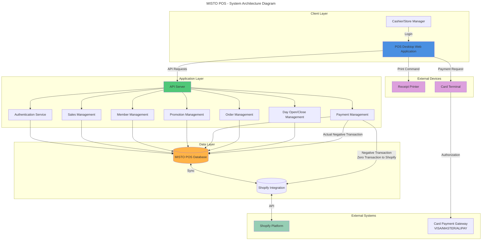

```mermaid
---
title: MISTO POS - System Architecture Diagram
---
graph TB
    subgraph "Client Layer"
        POS[POS Desktop Web Application]
        User1[Cashier/Store Manager]
    end

    subgraph "Application Layer"
        API[API Server]
        Auth[Authentication Service]
        SalesMgmt[Sales Management]
        MemberMgmt[Member Management]
        PromoMgmt[Promotion Management]
        PaymentMgmt[Payment Management]
        OrderMgmt[Order Management]
        DailyMgmt[Day Open/Close Management]
    end

    subgraph "Data Layer"
        DB[(MISTO POS Database)]
        ShopifyDB[(Shopify Integration)]
    end

    subgraph "External Devices"
        Printer[Receipt Printer]
        CardTerminal[Card Terminal]
    end

    subgraph "External Systems"
        Shopify[Shopify Platform]
        CardGateway[Card Payment Gateway<br/>VISA/MASTER/ALIPAY]
    end

    %% Client to Application
    User1 -->|Login| POS
    POS -->|API Requests| API

    %% API to Services
    API --> Auth
    API --> SalesMgmt
    API --> MemberMgmt
    API --> PromoMgmt
    API --> PaymentMgmt
    API --> OrderMgmt
    API --> DailyMgmt

    %% Services to Database
    Auth --> DB
    SalesMgmt --> DB
    MemberMgmt --> DB
    PromoMgmt --> DB
    PaymentMgmt --> DB
    OrderMgmt --> DB
    DailyMgmt --> DB

    %% Database Integration
    DB <-->|Sync| ShopifyDB
    ShopifyDB <-->|API| Shopify

    %% External Devices
    POS -->|Print Command| Printer
    POS -->|Payment Request| CardTerminal
    CardTerminal -->|Authorization| CardGateway

    %% Refund Handling
    PaymentMgmt -->|Negative Transaction<br/>Zero Transaction to Shopify| ShopifyDB
    PaymentMgmt -->|Actual Negative Transaction| DB

    style POS fill:#4A90E2
    style API fill:#50C878
    style DB fill:#FFB347
    style Shopify fill:#96CEB4
    style Printer fill:#DDA0DD
    style CardTerminal fill:#DDA0DD
```
