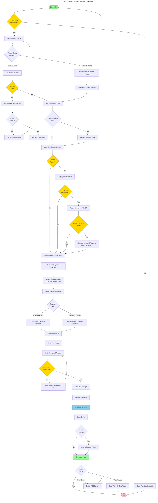

```mermaid
---
title: MISTO POS - Sales Process Flowchart
---
flowchart TD
    Start([Start Sales]) --> CheckDayOpen{Day Open<br/>Completed?}
    CheckDayOpen -->|No| BlockSales[Sales Function Disabled]
    CheckDayOpen -->|Yes| AddProduct[Add Products to Cart]

    AddProduct --> ScanMethod{Product Entry<br/>Method?}
    ScanMethod -->|Barcode Scan| BarcodeSearch[Search by Barcode]
    ScanMethod -->|Manual Search| ManualSearch[Open Product Search Popup]

    BarcodeSearch --> ProductFound{Product<br/>Found?}
    ProductFound -->|No| CheckOrder[Try Order Barcode Search]
    CheckOrder --> OrderFound{Order<br/>Found?}
    OrderFound -->|No| ShowError[Show Error Message]
    OrderFound -->|Yes| LoadOrder[Load Existing Order]
    ProductFound -->|Yes| AddToCart[Add to Products Grid]

    ManualSearch --> SelectProduct[Select from Search Results]
    SelectProduct --> AddToCart

    AddToCart --> ModifyProduct{Modify Product<br/>Info?}
    ModifyProduct -->|Yes| EditQty[Edit QTY/Selling Price]
    ModifyProduct -->|No| SearchMember
    EditQty --> SearchMember[Search & Select Member]

    SearchMember --> MemberFound{Member<br/>Found?}
    MemberFound -->|No| ApplyPromo
    MemberFound -->|Yes| DisplayMember[Display Member Info]
    DisplayMember --> CheckEmployee{Employee<br/>Purchase?}
    CheckEmployee -->|Yes| ToggleEmployee[Toggle Employee Sale ON]
    CheckEmployee -->|No| ApplyPromo
    ToggleEmployee --> CheckLimit{Within Purchase<br/>Limit?}
    CheckLimit -->|No| ApprovalRequired[Manager Approval Required<br/>Apply Limit Only]
    CheckLimit -->|Yes| ApplyPromo
    ApprovalRequired --> ApplyPromo

    ApplyPromo[Select & Apply Promotions] --> CalcSummary[Calculate Payment Summary]
    CalcSummary --> DisplaySummary[Display Sub Total, Tax,<br/>Promotion, Grand Total]

    DisplaySummary --> SelectPayment[Select Payment Method]
    SelectPayment --> PaymentType{Payment<br/>Type?}

    PaymentType -->|Single Payment| SinglePay[Select One Payment Method]
    PaymentType -->|Multiple Payment| MultiPay[Select Multiple Payment Methods]

    SinglePay --> ClickPay[Click Pay Button]
    MultiPay --> ClickPay

    ClickPay --> PayPopup[Open Pay Popup]
    PayPopup --> EnterAmount[Enter Received Amount]
    EnterAmount --> ValidateAmount{Amount >=<br/>Grand Total?}

    ValidateAmount -->|No| ShowInsufficientError[Show Insufficient Amount Error]
    ShowInsufficientError --> EnterAmount
    ValidateAmount -->|Yes| CalcChange[Calculate Change]

    CalcChange --> ConfirmPayment[Confirm Payment]
    ConfirmPayment --> ProcessPayment[Process Payment]
    ProcessPayment --> SaveOrder[Save Order]
    SaveOrder --> PrintReceipt{Print<br/>Receipt?}

    PrintReceipt -->|Yes| SendToPrinter[Send to Receipt Printer]
    PrintReceipt -->|No| CompleteOrder
    SendToPrinter --> CompleteOrder[Complete Order]

    CompleteOrder --> NextAction{Next<br/>Action?}
    NextAction -->|New Order| ResetScreen[Reset POS Screen]
    NextAction -->|View Orders| ViewOrders[Open View Orders Popup]
    NextAction -->|Done| End([End])

    ResetScreen --> Start
    ViewOrders --> End
    BlockSales --> End
    ShowError --> AddProduct

    style Start fill:#90EE90
    style End fill:#FFB6C1
    style CheckDayOpen fill:#FFD700
    style ProductFound fill:#FFD700
    style MemberFound fill:#FFD700
    style CheckEmployee fill:#FFD700
    style CheckLimit fill:#FFD700
    style ValidateAmount fill:#FFD700
    style ProcessPayment fill:#87CEEB
    style CompleteOrder fill:#98FB98
```
