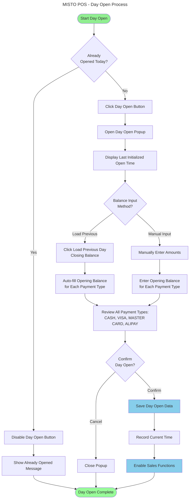
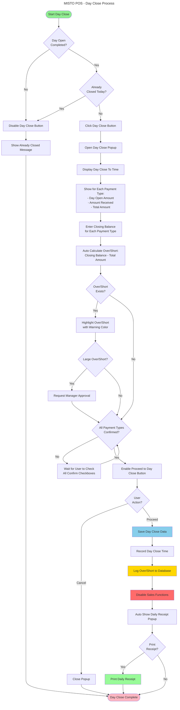
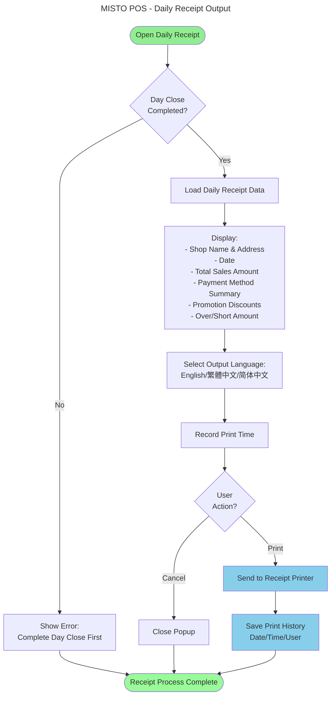

## Day Open Process

```mermaid
---
title: MISTO POS - Day Open Process
---
flowchart TD
    StartOpen([Start Day Open]) --> CheckAlreadyOpen{Already<br/>Opened Today?}
    CheckAlreadyOpen -->|Yes| DisableButton[Disable Day Open Button]
    CheckAlreadyOpen -->|No| ClickDayOpen[Click Day Open Button]

    ClickDayOpen --> OpenPopup[Open Day Open Popup]
    OpenPopup --> ShowLastTime[Display Last Initialized Open Time]

    ShowLastTime --> InputMethod{Balance Input<br/>Method?}
    InputMethod -->|Load Previous| LoadPrevious[Click Load Previous Day<br/>Closing Balance]
    InputMethod -->|Manual Input| ManualInput[Manually Enter Amounts]

    LoadPrevious --> AutoFill[Auto-fill Opening Balance<br/>for Each Payment Type]
    ManualInput --> EnterAmounts[Enter Opening Balance<br/>for Each Payment Type]

    AutoFill --> ReviewAmounts[Review All Payment Types:<br/>CASH, VISA, MASTER CARD, ALIPAY]
    EnterAmounts --> ReviewAmounts

    ReviewAmounts --> ConfirmOpen{Confirm<br/>Day Open?}
    ConfirmOpen -->|Cancel| ClosePopup[Close Popup]
    ConfirmOpen -->|Confirm| SaveOpenData[Save Day Open Data]

    SaveOpenData --> RecordTime[Record Current Time]
    RecordTime --> EnableSales[Enable Sales Functions]
    EnableSales --> EndOpen([Day Open Complete])

    DisableButton --> ShowMessage[Show Already Opened Message]
    ShowMessage --> EndOpen
    ClosePopup --> EndOpen

    style StartOpen fill:#90EE90
    style EndOpen fill:#98FB98
    style SaveOpenData fill:#87CEEB
    style EnableSales fill:#87CEEB
```

## Day Close Process

```mermaid
---
title: MISTO POS - Day Close Process
---
flowchart TD
    StartClose([Start Day Close]) --> CheckDayOpen{Day Open<br/>Completed?}
    CheckDayOpen -->|No| DisableClose[Disable Day Close Button]
    CheckDayOpen -->|Yes| CheckAlreadyClosed{Already<br/>Closed Today?}

    CheckAlreadyClosed -->|Yes| DisableClose
    CheckAlreadyClosed -->|No| ClickDayClose[Click Day Close Button]

    ClickDayClose --> OpenClosePopup[Open Day Close Popup]
    OpenClosePopup --> DisplayCloseTime[Display Day Close To Time]

    DisplayCloseTime --> ShowCalculation[Show for Each Payment Type:<br/>- Day Open Amount<br/>- Amount Received<br/>- Total Amount]

    ShowCalculation --> EnterClosing[Enter Closing Balance<br/>for Each Payment Type]

    EnterClosing --> CalcDifference[Auto Calculate Over/Short:<br/>Closing Balance - Total Amount]

    CalcDifference --> CheckDifference{Over/Short<br/>Exists?}
    CheckDifference -->|Yes| HighlightDifference[Highlight Over/Short<br/>with Warning Color]
    CheckDifference -->|No| CheckConfirm

    HighlightDifference --> RequireApproval{Large Over/Short?}
    RequireApproval -->|Yes| ManagerApproval[Request Manager Approval]
    RequireApproval -->|No| CheckConfirm
    ManagerApproval --> CheckConfirm

    CheckConfirm{All Payment Types<br/>Confirmed?} -->|No| WaitConfirm[Wait for User to Check<br/>All Confirm Checkboxes]
    WaitConfirm --> CheckConfirm
    CheckConfirm -->|Yes| EnableProceed[Enable Proceed to Day Close Button]

    EnableProceed --> ProceedChoice{User<br/>Action?}
    ProceedChoice -->|Cancel| CancelClose[Close Popup]
    ProceedChoice -->|Proceed| SaveCloseData[Save Day Close Data]

    SaveCloseData --> RecordCloseTime[Record Day Close Time]
    RecordCloseTime --> LogOverShort[Log Over/Short to Database]
    LogOverShort --> DisableSales[Disable Sales Functions]
    DisableSales --> ShowDailyReceipt[Auto Show Daily Receipt Popup]

    ShowDailyReceipt --> ReceiptAction{Print<br/>Receipt?}
    ReceiptAction -->|Yes| PrintDaily[Print Daily Receipt]
    ReceiptAction -->|No| EndClose
    PrintDaily --> EndClose([Day Close Complete])

    DisableClose --> ShowClosedMessage[Show Already Closed Message]
    ShowClosedMessage --> EndClose
    CancelClose --> EndClose

    style StartClose fill:#90EE90
    style EndClose fill:#FFB6C1
    style SaveCloseData fill:#87CEEB
    style DisableSales fill:#FF6B6B
    style LogOverShort fill:#FFD700
    style PrintDaily fill:#98FB98
```

## Daily Receipt Output

```mermaid
---
title: MISTO POS - Daily Receipt Output
---
flowchart TD
    StartReceipt([Open Daily Receipt]) --> CheckDayClose{Day Close<br/>Completed?}
    CheckDayClose -->|No| ShowError[Show Error:<br/>Complete Day Close First]
    CheckDayClose -->|Yes| LoadReceiptData[Load Daily Receipt Data]

    LoadReceiptData --> DisplayInfo[Display:<br/>- Shop Name & Address<br/>- Date<br/>- Total Sales Amount<br/>- Payment Method Summary<br/>- Promotion Discounts<br/>- Over/Short Amount]

    DisplayInfo --> SelectLanguage[Select Output Language:<br/>English/繁體中文/简体中文]

    SelectLanguage --> RecordPrintTime[Record Print Time]

    RecordPrintTime --> UserAction{User<br/>Action?}
    UserAction -->|Cancel| CloseReceiptPopup[Close Popup]
    UserAction -->|Print| SendToPrinter[Send to Receipt Printer]

    SendToPrinter --> SavePrintHistory[Save Print History<br/>Date/Time/User]
    SavePrintHistory --> EndReceipt([Receipt Process Complete])

    ShowError --> EndReceipt
    CloseReceiptPopup --> EndReceipt

    style StartReceipt fill:#90EE90
    style EndReceipt fill:#98FB98
    style SendToPrinter fill:#87CEEB
    style SavePrintHistory fill:#87CEEB
```
