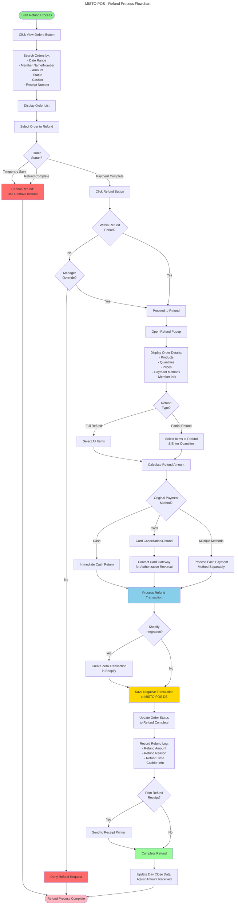
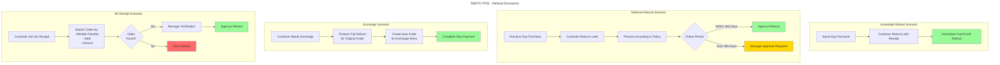

```mermaid
---
title: MISTO POS - Refund Process Flowchart
---
flowchart TD
    Start([Start Refund Process]) --> OpenViewOrders[Click View Orders Button]
    OpenViewOrders --> SearchOrders[Search Orders by:<br/>- Date Range<br/>- Member Name/Number<br/>- Amount<br/>- Status<br/>- Cashier<br/>- Receipt Number]

    SearchOrders --> DisplayResults[Display Order List]
    DisplayResults --> SelectOrder[Select Order to Refund]
    SelectOrder --> CheckStatus{Order<br/>Status?}

    CheckStatus -->|Temporary Save| CannotRefund[Cannot Refund:<br/>Use Remove Instead]
    CheckStatus -->|Refund Complete| CannotRefund
    CheckStatus -->|Payment Complete| ClickRefund[Click Refund Button]

    ClickRefund --> CheckRefundPeriod{Within Refund<br/>Period?}
    CheckRefundPeriod -->|No| CheckManagerOverride{Manager<br/>Override?}
    CheckManagerOverride -->|No| DenyRefund[Deny Refund Request]
    CheckManagerOverride -->|Yes| ProceedRefund
    CheckRefundPeriod -->|Yes| ProceedRefund[Proceed to Refund]

    ProceedRefund --> OpenRefundPopup[Open Refund Popup]
    OpenRefundPopup --> DisplayOrderDetails[Display Order Details:<br/>- Products<br/>- Quantities<br/>- Prices<br/>- Payment Methods<br/>- Member Info]

    DisplayOrderDetails --> RefundType{Refund<br/>Type?}
    RefundType -->|Full Refund| SelectAllItems[Select All Items]
    RefundType -->|Partial Refund| SelectItems[Select Items to Refund<br/>& Enter Quantities]

    SelectAllItems --> CalcRefundAmount
    SelectItems --> CalcRefundAmount[Calculate Refund Amount]

    CalcRefundAmount --> CheckPaymentMethod{Original Payment<br/>Method?}
    CheckPaymentMethod -->|Cash| CashRefund[Immediate Cash Return]
    CheckPaymentMethod -->|Card| CardRefund[Card Cancellation/Refund]
    CheckPaymentMethod -->|Multiple Methods| SplitRefund[Process Each Payment<br/>Method Separately]

    CashRefund --> ProcessRefund
    CardRefund --> ContactCardGateway[Contact Card Gateway<br/>for Authorization Reversal]
    ContactCardGateway --> ProcessRefund
    SplitRefund --> ProcessRefund[Process Refund Transaction]

    ProcessRefund --> CreateNegativeTransaction{Shopify<br/>Integration?}
    CreateNegativeTransaction -->|Yes| ShopifyZeroTransaction[Create Zero Transaction<br/>in Shopify]
    CreateNegativeTransaction -->|No| SaveToMistoDB
    ShopifyZeroTransaction --> SaveToMistoDB[Save Negative Transaction<br/>to MISTO POS DB]

    SaveToMistoDB --> UpdateOrderStatus[Update Order Status<br/>to Refund Complete]
    UpdateOrderStatus --> RecordRefundLog[Record Refund Log:<br/>- Refund Amount<br/>- Refund Reason<br/>- Refund Time<br/>- Cashier Info]

    RecordRefundLog --> PrintRefundReceipt{Print Refund<br/>Receipt?}
    PrintRefundReceipt -->|Yes| SendRefundToPrinter[Send to Receipt Printer]
    PrintRefundReceipt -->|No| CompleteRefund
    SendRefundToPrinter --> CompleteRefund[Complete Refund]

    CompleteRefund --> UpdateDayCloseData[Update Day Close Data:<br/>Adjust Amount Received]

    UpdateDayCloseData --> End([Refund Process Complete])
    CannotRefund --> End
    DenyRefund --> End

    style Start fill:#90EE90
    style End fill:#FFB6C1
    style ProcessRefund fill:#87CEEB
    style SaveToMistoDB fill:#FFD700
    style CompleteRefund fill:#98FB98
    style CannotRefund fill:#FF6B6B
    style DenyRefund fill:#FF6B6B
```

## Refund Scenarios

```mermaid
---
title: MISTO POS - Refund Scenarios
---
graph TD
    subgraph "Immediate Refund Scenario"
        IR1[Same Day Purchase] --> IR2[Customer Returns with Receipt]
        IR2 --> IR3[Immediate Cash/Card Refund]
    end

    subgraph "Deferred Refund Scenario"
        DR1[Previous Day Purchase] --> DR2[Customer Returns Later]
        DR2 --> DR3[Process According to Policy]
        DR3 --> DR4{Check Period}
        DR4 -->|Within 365 Days| DR5[Approve Refund]
        DR4 -->|Over 365 Days| DR6[Manager Approval Required]
    end

    subgraph "Exchange Scenario"
        EX1[Customer Wants Exchange] --> EX2[Process Full Refund<br/>for Original Order]
        EX2 --> EX3[Create New Order<br/>for Exchange Items]
        EX3 --> EX4[Complete New Payment]
    end

    subgraph "No Receipt Scenario"
        NR1[Customer Has No Receipt] --> NR2[Search Order by:<br/>- Member Number<br/>- Date<br/>- Amount]
        NR2 --> NR3{Order<br/>Found?}
        NR3 -->|Yes| NR4[Manager Verification]
        NR3 -->|No| NR5[Deny Refund]
        NR4 --> NR6[Approve Refund]
    end

    style IR3 fill:#98FB98
    style DR5 fill:#98FB98
    style EX4 fill:#98FB98
    style NR6 fill:#98FB98
    style DR6 fill:#FFD700
    style NR5 fill:#FF6B6B
```
