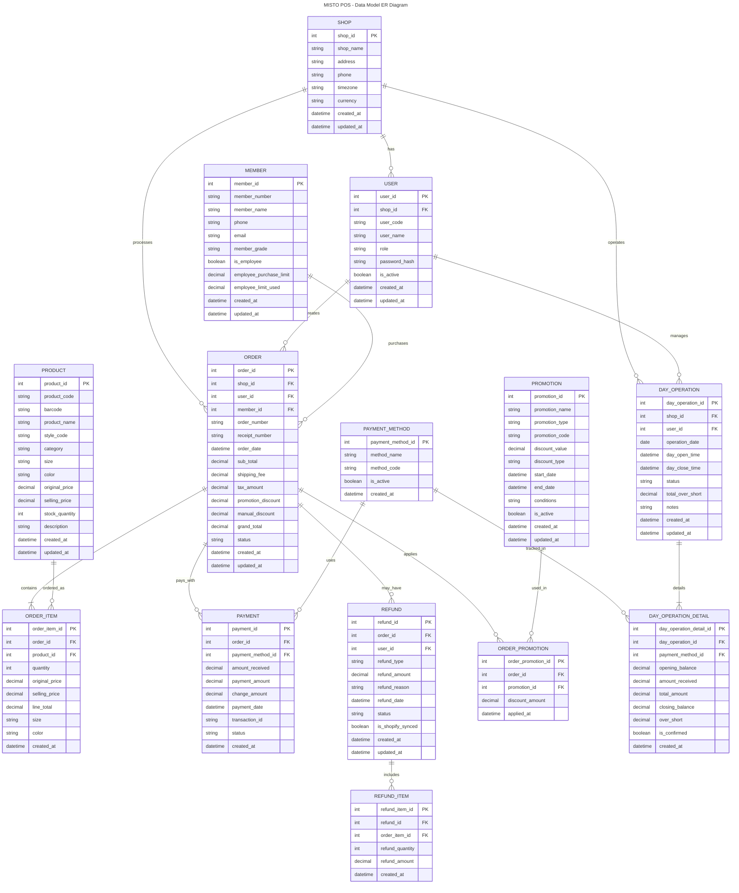

## Database Schema Relationships

### Core Business Flow
1. **Shop Management**: SHOP → USER → DAY_OPERATION
2. **Sales Process**: USER → ORDER → ORDER_ITEM → PRODUCT
3. **Member Management**: MEMBER → ORDER
4. **Payment Processing**: ORDER → PAYMENT → PAYMENT_METHOD
5. **Promotion System**: PROMOTION → ORDER_PROMOTION → ORDER
6. **Refund Handling**: ORDER → REFUND → REFUND_ITEM

### Key Constraints
- One ORDER can have multiple PAYMENTS (split payment)
- One ORDER can have multiple PROMOTIONS applied
- One DAY_OPERATION has multiple DAY_OPERATION_DETAIL (one per payment method)
- One REFUND can have multiple REFUND_ITEMS (partial refund)
- MEMBER is optional for ORDER (non-member purchases allowed)
